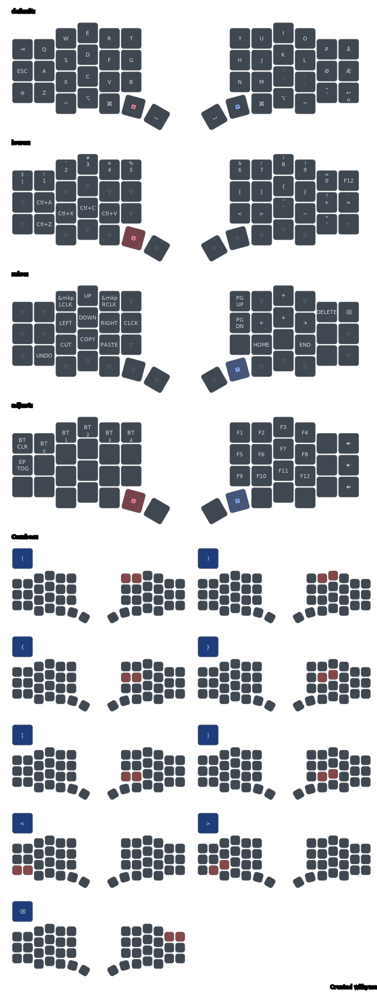

# FlakeM DIY

## Wiring
Rows from top to bottom, cols from left to right
### Rows GPIO
21, 20, 19, 18, 15

### Left Cols GPIO
2, 7, 6, 5, 4, 3

### Right Cols GPIO
3, 4, 5, 6, 7, 2

## Resources
- [The Flake keyboard](https://github.com/anywhy-io/flake)
- [ZMK - New Keyboard Shield](https://zmk.dev/docs/development/hardware-integration/new-shield)
- [Budget Wireless Corne Keyboard Build](https://github.com/milar111/Corne)
